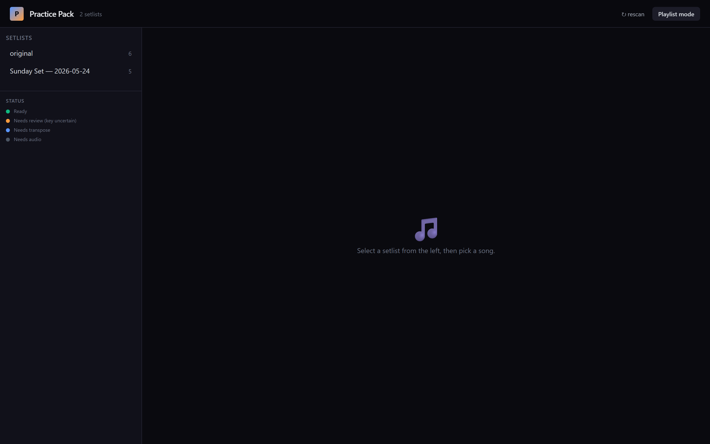
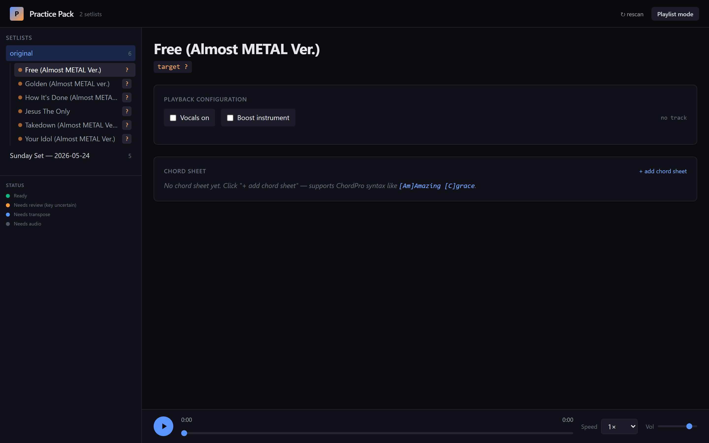
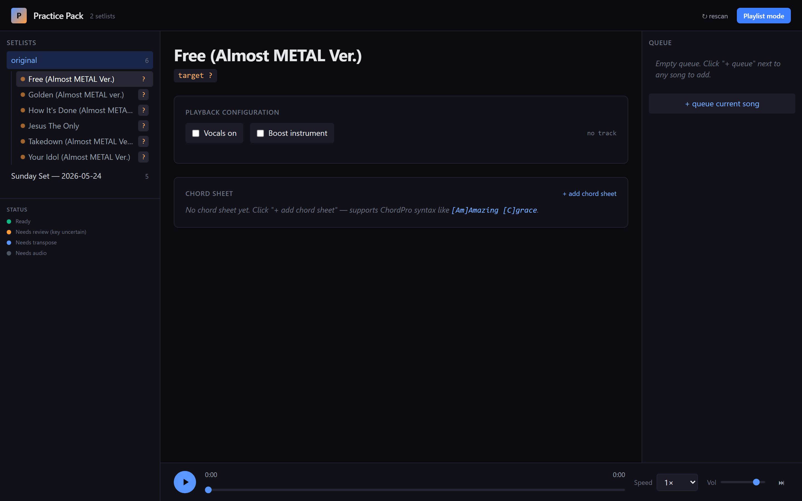

# Practice Pack — web app

Browse and play the practice-pack output of the AbletonFullControlMCP
song-flow pipeline (setlists → songs → boost tracks) in a fast, keyboard-
friendly dark UI. Runs locally; can be exposed on the LAN so you can
open it on a laptop in the music room while the server sits on your
main box.

## Screenshots

| | |
|---|---|
|  |  |
|  |  |

## What it does

- **Scans a root directory** for setlists and, per setlist, songs. Each
  song gets its metadata parsed and its per-instrument boost tracks
  indexed automatically from filename conventions.
- **Serves audio with HTTP range** so the HTML5 seek bar works on
  multi-hundred-MB WAVs without downloading the whole file.
- **Playback config UI**: toggle vocals on/off, pick which instrument
  to boost, jump to a specific chord section — no editing files.
- **Chord/lyric sheets**: recognises `chords.pro`, `chords.md`,
  `lyrics.md`, `chord_sheet.txt` per song. Renders inline. Editable
  from the UI, saved back to disk.
- **Playlists**: cross-setlist song sequences with per-item playback
  settings. Useful when practising a set in a specific order or
  building a "chords I don't know yet" queue.
- **Key-review flow**: songs with uncertain source keys land as
  `needs_review` and prompt for confirmation in the UI. The confirmation
  is saved back to the song's `meta.json` and updates its status.

## Directory conventions

The server scans `PRACTICE_PACK_ROOT` (default `D:/Music/YouTube/practice_pack/`)
for setlists. Structure:

```
PRACTICE_PACK_ROOT/
├── <setlist_id>/
│   ├── setlist.json              # optional — controls name, date, song order
│   └── <song_id>/                # song directory naming is "Title - Key"
│       ├── meta.json             # optional — overrides derived fields
│       ├── chords.pro            # optional — ChordPro sheet
│       ├── <song> - no_vocals.wav
│       ├── <song> - drums_boost_no_vocals.wav
│       ├── <song> - drums_boost_with_vocals.wav
│       ├── <song> - bass_boost_no_vocals.wav
│       ├── ...
│       └── stems/                # raw demucs output (indexed but not played)
└── <another setlist>/
```

Directories prefixed with `_` under a setlist are ignored (the song-flow
pipeline uses them for intermediate bounces).

### Song directory name → title + key

The convention is `"<title> - <target_key>"`. Everything after the last
` - ` is treated as the key. Both flats (`Db`) and sharps (`D#`) work —
the key-shift math normalises flats to sharps internally.

### File name → track type

Filenames are parsed for boost-track patterns:

| Pattern | Recognised as |
|---|---|
| `<song> - no_vocals.wav` (or `no_vocals` alone) | `no_vocals` — instrumental backing |
| `<song> - full_mix.wav` | `full_mix` — everything at unity |
| `<song> - <instrument> boost (no vocals)` | `<instrument>_no_vocals` |
| `<song> - <instrument> boost (with vocals)` | `<instrument>_with_vocals` |
| `<song> - <instrument>_boost_no_vocals` | snake-case variant, same as above |

Recognised instruments: `drums`, `bass`, `other`, `guitar`, `piano`.

### Song status is inferred

If `meta.json` doesn't set `status`, the scanner picks one:

- `ready` — has `no_vocals.wav` on disk
- `partial` — has some boost tracks but no `no_vocals.wav`
- `needs_audio` — no wavs at all
- `needs_review` — set explicitly in `meta.json` when source key is
  uncertain; the UI shows a resolve-key dialog

## Schemas

### `setlist.json` (optional, per setlist directory)

```json
{
  "name": "Sunday Set",
  "date": "2026-07-12",
  "song_order": [
    "He Shall Be Praised - Db",
    "Owe You Praise - Eb",
    "WL Moment - Lydia",
    "Jesus Be The Name - C"
  ],
  "notes": "any freeform text you want to show in the setlist header"
}
```

- `song_order` is a list of directory names in the setlist. Any songs
  not listed are appended at the end in alphabetical order.
- Without `setlist.json`, the setlist name derives from the directory
  name and songs sort alphabetically.

### `meta.json` (optional, per song directory)

Every field is optional. What the scanner reads:

```json
{
  "title": "He Shall Be Praised",
  "target_key": "Db",
  "source_key": "D#",
  "shift_semitones": -1,
  "youtube_url": "https://youtu.be/4hrJ_Md559g",
  "tempo_bpm": 74,
  "notes": "SHORTENED — cut V2 for time",
  "status": "ready",
  "review_question": "Is this in Ab or Db?",
  "candidate_source_keys": ["Ab", "Db"],
  "lead": "Trae",
  "main_harmony": "Sara",
  "arrangement": "shortened"
}
```

Custom keys (`lead`, `main_harmony`, `arrangement`, whatever) are
preserved as-is on read and passed through to the frontend. Only the
named fields above are interpreted; everything else is display-only.

## Install & run

Requires Python 3.11+ and `fastapi + uvicorn`. If you already installed
the parent project's venv, use it:

```bash
D:/Code/AbletonFullControlMCP/.venv/Scripts/python.exe -m pip install fastapi uvicorn
```

Or in a standalone venv:

```bash
python -m pip install fastapi uvicorn
```

### Modes

```bash
# localhost only — safest, only reachable from this machine
python D:/Code/AbletonFullControlMCP/practice_app/server.py

# LAN mode — reachable from any device on your local network
python D:/Code/AbletonFullControlMCP/practice_app/server.py --lan

# custom port
python server.py --lan --port 9000
```

The server prints a startup banner with the exact URLs to type into
each device's browser:

```
==============================================================
  Practice Pack -- listening on 0.0.0.0:8765
==============================================================
    Local:    http://127.0.0.1:8765
    Network:  http://192.168.1.140:8765

    LAN MODE: reachable by any device on your local
    network. If a device can't connect, Windows Firewall
    may be blocking inbound TCP on this port -- accept the
    prompt when it appears, or add an inbound rule manually.
==============================================================
```

### First LAN launch on Windows

Windows Defender Firewall pops a prompt the first time uvicorn tries
to bind `0.0.0.0`. Choose **Allow** on private/domain networks; leave
public unchecked unless you actually want the app reachable from any
network. If you already dismissed the prompt, add an inbound rule
manually via `wf.msc` for TCP 8765.

## API

The frontend is a static Alpine.js app that consumes these JSON
endpoints. Available for scripting / integration.

| Method | Path | Purpose |
|---|---|---|
| `GET` | `/api/setlists` | All setlists with full song details (one-shot hydration) |
| `GET` | `/api/setlists/{setlist_id}` | Single setlist |
| `GET` | `/api/audio/{setlist_id}/{song_id}/{filename}` | Serve audio with HTTP range support |
| `HEAD` | `/api/audio/{setlist_id}/{song_id}/{filename}` | Range-probe reply for browsers that HEAD first |
| `GET` | `/api/sheet/{setlist_id}/{song_id}` | Fetch chord/lyric sheet as plain text |
| `PUT` | `/api/sheet/{setlist_id}/{song_id}` | Save sheet — body: `{filename, content}` |
| `PUT` | `/api/resolve/{setlist_id}/{song_id}` | Resolve a `needs_review` song's source key — body: `{chosen_key: "G"}` |
| `GET` | `/api/playlists` | List all saved playlists |
| `GET` | `/api/playlists/{playlist_id}` | Single playlist |
| `PUT` | `/api/playlists/{playlist_id}` | Save/overwrite playlist — body: `{name, items:[...]}` |
| `DELETE` | `/api/playlists/{playlist_id}` | Remove playlist |

Every endpoint returns JSON. Audio endpoints return `audio/wav` with
`Content-Range` when a range header is supplied.

## Where playlists live

Saved under `practice_app/data/playlists/<playlist_id>.json`. Playlist
IDs are alphanumeric plus `_-` only. The `data/` directory is gitignored
so your personal playlists don't get committed.

## Frontend stack

Static, vendored for offline use:

- **Tailwind CSS** (`static/vendor/tailwind.js`) — utility styling
- **Alpine.js** + `alpine-collapse` (`static/vendor/*`) — reactive
  primitives, no build step
- **Vanilla HTML/CSS/JS** for everything else (`static/{index.html,app.js,style.css}`)

No node/npm; the whole frontend works from a static file server. If
you're not on your dev machine and the app fails to load, check that
the vendor scripts are actually being served (`/vendor/tailwind.js`
should return 200).
